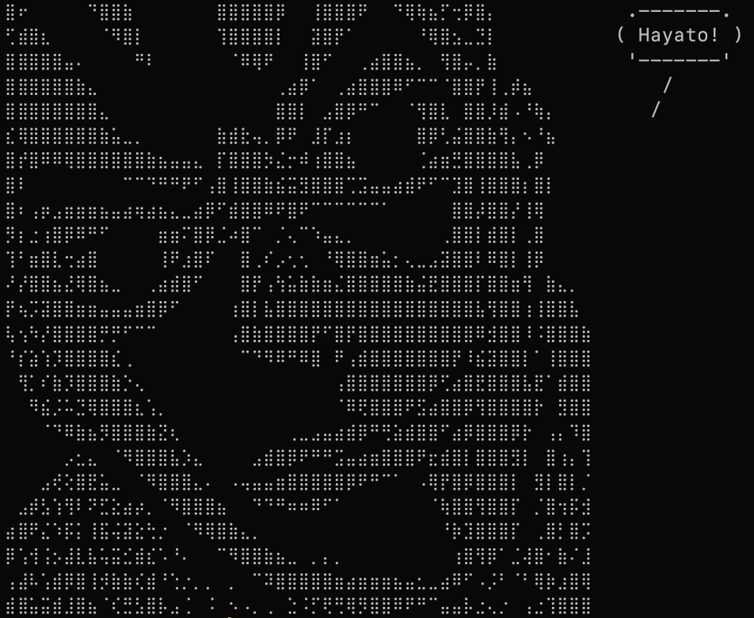
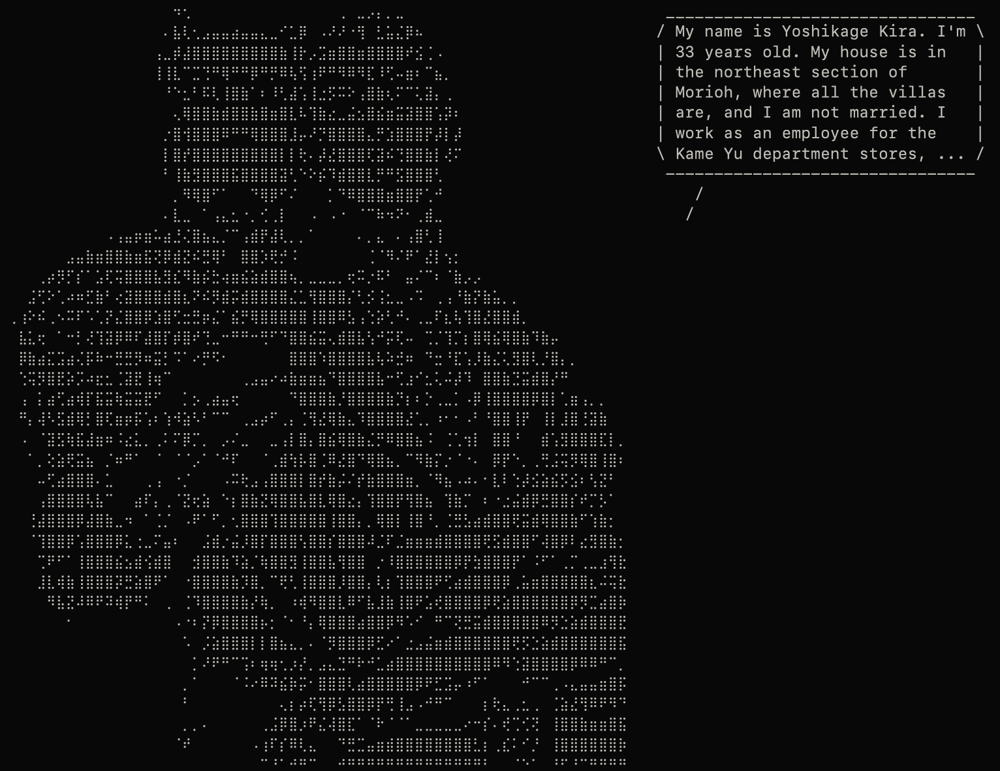
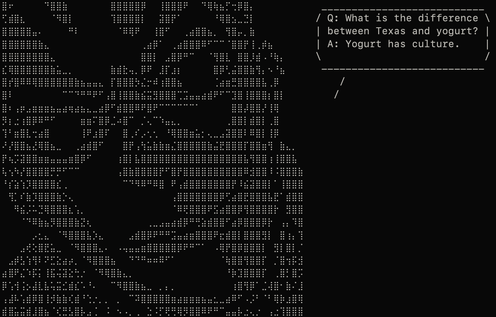

<div align="center">
  <h1>KiraSay</h1>
  <p>Kira says a lot.</p>
</div>

KiraSay is a small, playful command-line program inspired by `cowsay` that prints a message alongside ASCII/Unicode "Kira" art. The project is written in Perl and aims to be minimal, portable, and easy to install.

## Screenshots

<div align="center">
  
  <p>kirasay -b round "Hayato\!"</p>
  <br/>
  
  <p>kirasay -a stand "My name is Yoshikage Kira. I'm 33 years old. My house is in the northeast section of Morioh, where all the villas are, and I am not married. I work as an employee for the Kame Yu department stores, ..."</p>
  <br/>
  
  <p>fortune | kirasay</p>
</div>

## Installation

The package is available on the AUR as `kirasay` for Arch Linux (btw) users.
```bash
yay -S kirasay
```

There are a few easy ways to install and run `kirasay`.

1. Run in-place (no install):
```bash
./kirasay "Hello from Kira!"
```

2. Make the script executable and move to a directory in your `PATH`:
```bash
chmod +x kirasay
sudo cp kirasay /usr/local/bin/kirasay
```

3. Use the provided `Makefile` targets (recommended). See the `Makefile` section below for full content — common targets:
- `make install` — install to `/usr/local` by default
- `make uninstall` — remove installed file
- `make release` — create a tarball release

Example:
```bash
make install PREFIX=/usr/local
```

## Usage

Invoke the script with a message (quotes recommended when the message contains spaces):
```bash
kirasay "I'm feeling cute today."
```

The script accepts command-line options. To see the exact runtime options supported on your copy, run:
```bash
kirasay -h
# or
kirasay --help
```

Typical usage examples:
- Basic:
```bash
./kirasay "Hello world"
```

- From anywhere after install:
```bash
kirasay "This is installed!"
```

If you want a shell alias or function, simply call `kirasay` with the message string.

## License

This project is licensed under the MIT License — see `./LICENSE`.
